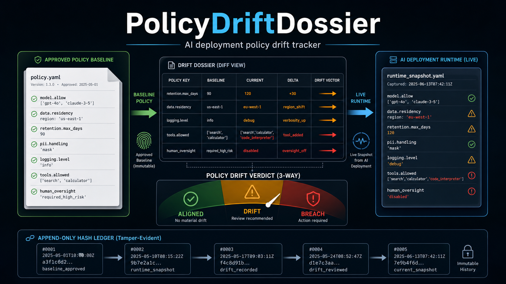

<p align="center">
  
</p>

<h1 align="center">PolicyDriftDossier</h1>

<p align="center">
  <em>AI deployment policy drift tracker.<br>
  Answers one deterministic question: <strong>Has this AI deployment drifted from its approved policy baseline?</strong></em>
</p>

---

## What this is

PolicyDriftDossier compares an observed AI deployment state against an approved policy baseline and produces a 3-way verdict:

- **aligned** — all required clauses match the baseline
- **drift** — some clauses differ but remain within tolerance
- **breach** — a required clause is outside tolerance or missing

It is a direct transplant of two corpus primitives:

- **DriftDossier** (clinical protocol drift compilation) → policy drift engine
- **CertMesh** (robot behavior policy drift certification) → severity aggregate gate

## Verdict scheme

```text
aligned → drift → breach
```

## CLI triplet

```bash
python policy_drift_dossier.py sample --out examples/
python policy_drift_dossier.py run --baseline examples/baseline.json --state examples/state_drift.json
python policy_drift_dossier.py report --result result.json
```

## Quick start

```bash
cd PolicyDriftDossier
python policy_drift_dossier.py sample --out examples/
python policy_drift_dossier.py run --baseline examples/baseline.json --state examples/state_aligned.json --format markdown
python policy_drift_dossier.py run --baseline examples/baseline.json --state examples/state_breach.json --format json
```

## Dual output

Every `run` produces both machine JSON and human Markdown:

- JSON: full diff, verdict, hash-chained ledger entry
- Markdown: formatted report with clause table and ledger hash

## Boundary

> This is **not** a model evaluation (metric benchmark) system, and it is **not** a model-card registry. It tracks only whether a deployed AI system's runtime attributes have drifted from an approved policy baseline.

## Design origin

Generated by the `recreate` methodology from the `recreate_prj` corpus (run `003-policy-drift-dossier`).

## License

MIT — see [LICENSE](LICENSE).

## Author

Jung Wook Yang (양정욱) · GitHub [@sadpig70](https://github.com/sadpig70)
